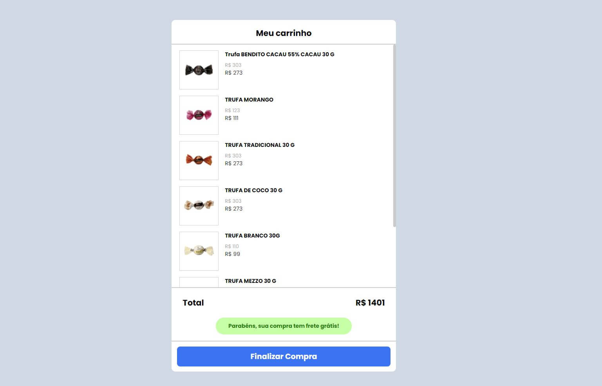

<h1 align="center">
    
    <br>
    codeby Bomboniere
</h1>

<h4 align="center">
  Navegação
</h4>

<p align="center">
  <a href="#rocket-tecnologias">Tecnologias</a>&nbsp;&nbsp;&nbsp;|&nbsp;&nbsp;&nbsp;
  <a href="#information_source-Como-Utilizar">Como Utilizar</a>&nbsp;&nbsp;&nbsp;
</p>

<div align="center">

  

  

  

</div>


## :rocket: Tecnologias

No desenvolvimento deste desafio utilizei:

-  [ReactJS](https://reactjs.org/)
-  [React Router DOM](https://reactrouter.com/web/guides/quick-start)
-  [Axios](https://github.com/axios/axios)
-  [styled-components](https://www.styled-components.com/)
-  [Lottie Animations](https://www.npmjs.com/package/react-lottie)
-  [JSON Server](https://github.com/typicode/json-server#getting-started)
-  [VS Code][vc] com [Dracula Theme][dracula]


## :information_source: Como Utilizar

Para utilizar esta aplicação você deverá instalar o [Git](https://git-scm.com), [Node.js v10.16][nodejs] or higher + [Yarn v1.13][yarn]. Vamos aos comandos:

### Primeiros Passos

```bash
# Clone este repositório
$ git clone https://github.com/patryckgratao/codeby-challenge

# Vá até a pasta do repositório baixado
$ cd codeby-challenge

```

### Rodando o Back-end
Este sistema utiliza o [JSON Server](https://github.com/typicode/json-server#getting-started) como servidor de API local.

A porta que ele utilizará é a 3333, caso queira trocar, basta editar o script server dentro do package.json.

```bash

# Instale o JSON Server
$ npm install -g json-server

# Inicie o servidor
$ yarn server

```

### Rodando o Front-end
```bash

# Instale as dependências
$ yarn install

# Rode o app
$ yarn start

```

### Prontinho, agora o app está pronto para uso. Obrigado e nos vemos em breve.


---

Feito com 💗 por [Patryck Gratão](https://api.whatsapp.com/send?phone=5562996880462).

[nodejs]: https://nodejs.org/
[yarn]: https://yarnpkg.com/
[vc]: https://code.visualstudio.com/
[vceditconfig]: https://marketplace.visualstudio.com/items?itemName=EditorConfig.EditorConfig
[vceslint]: https://marketplace.visualstudio.com/items?itemName=dbaeumer.vscode-eslint
[dracula]: https://draculatheme.com/
